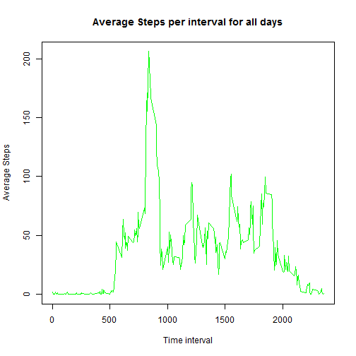
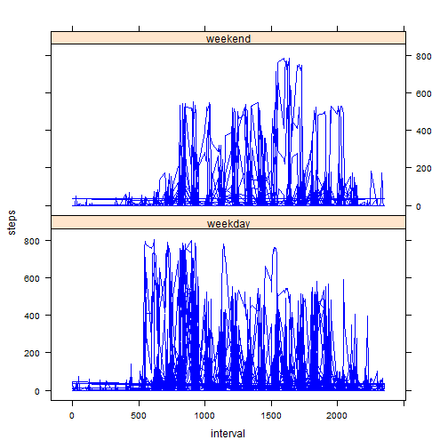

title: "Reproducible Research: Peer Assessment 1"
=================================================
output: 
  html_document:
    keep_md: true
---


## Loading and preprocessing the data

```r
(echo = TRUE)
```

```
## [1] TRUE
```

```r
setwd("C:/Users/Dell/Documents/DataScientist/testdata")
##url <- "https://d396qusza40orc.cloudfront.net/repdata%2Fdata%2Factivity.zip"
##download.file(url, "activity.zip",mode="wb")
##unzip("activity.zip")

      activity1 <- read.table( "activity.csv" , header = TRUE ,
                         sep=","  )
```
## What is mean total number of steps taken per day?

```r
echo=TRUE
     totalsteps <- tapply(activity1$steps, activity1$date, sum) 
     hist(totalsteps,col="green",main="Total number of steps taken each day",xlab="Total number of Steps")
```


```r
    meanstepsperday<-aggregate(activity1$steps ~ activity1$date,FUN = mean)
    colnames(meanstepsperday)<-c("date","steps")
    summary(meanstepsperday$steps)
```

```
##    Min. 1st Qu.  Median    Mean 3rd Qu.    Max. 
##  0.1424 30.7000 37.3800 37.3800 46.1600 73.5900
```
## What is the average daily activity pattern?

```r
echo=TRUE
     meanstepsperint<-aggregate(activity1$steps ~ activity1$interval,FUN = mean)
     colnames(meanstepsperint) <-c("interval","avgsteps")
     plot(meanstepsperint$interval,meanstepsperint$avgsteps, type="l",main="Average Steps per interval for all days",xlab="Time interval",ylab="Average Steps", col= "green")
```



```r
     maxstep <-which.max(meanstepsperint$avgsteps) 
     meanstepsperint[maxstep,]
```

```
##     interval avgsteps
## 104      835 206.1698
```
## Imputing missing values

```r
echo=TRUE
     sumNA <-sum(is.na(activity1$steps))
     temp<- activity1
     repNA <-replace(temp,is.na(temp),37.38)
     sum(is.na(repNA$steps))
```

```
## [1] 0
```


## Are there differences in activity patterns between weekdays and weekends?

```r
echo=TRUE
library(timeDate)
library(lattice)
     repNA$weekday1<-isWeekday(repNA$date, wday = 1:5)
     repNA$weekday1 <- ifelse(repNA$weekday1==TRUE,"weekday","weekend")
     repNA$weekday1<-factor(repNA$weekday1)
     xyplot(steps ~interval | weekday1,data=repNA,layout=c(1,2),type="l",col=c("blue","green"))
```



```r
     totalsteps2 <- tapply(repNA$steps, repNA$date, sum) 
     hist(totalsteps2,col="green",main="Total number of steps taken each day",xlab="Total number of Steps")
```


```r
     meanstepsperday2<-aggregate(repNA$steps ~ repNA$date,FUN = mean)
     colnames(meanstepsperday2)<-c("date","steps")
     summary(meanstepsperday2$steps)
```

```
##    Min. 1st Qu.  Median    Mean 3rd Qu.    Max. 
##  0.1424 34.0900 37.3800 37.3800 44.4800 73.5900
```

